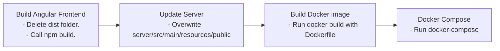
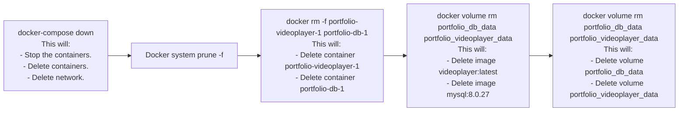

Updated on 04. 09. 2023

# Portfolio (Nándor Segyevy)
A collection of my project I intend to list in my portfolio.

Table of content

<ol>
<li>

[Video Player Angular Frontend](#1_0)</li>
<ol>
<li>

[Routes](#1_1)
</li>
<li>

[Components](#1_2)
</li>
<ol>
<li>

[app.component](#1_2_1)
</li>
<li>

[playlist-list](#1_2_2)
</li>
<li>

[playlist-player](#1_2_3)
</li>
<li>

[video-player-layout](#1_2_4)
</li>
<li>

[progress](#1_2_5)
</li>
<li>

[progress-slider](#1_2_6)
</li>
</ol>
</ol>
<li>

[Video Player Java Spring Boot Backend](#2_0)</li>
<ol>
<li>

[Domain](#2_1)</li>
<li>

[Rest API Entry Points](#2_2)</li>
<ol>
<li>

[Folder Controller](#2_2_1)</li>
<ol>
<li>

[GET -/api/folders/all](#2_2_1_1)</li>
<li>

[GET - /api/folders/{id}](#2_2_1_2)</li>
<li>

[POST - /api/folders/playlist](#2_2_1_3)</li>
<li>

[GET - /api/folders/playlist/narutoFillerFree](#2_2_1_4)</li>
<li>

[GET - /api/folders/playlist](#2_2_1_5)</li>
<li>

[GET - /api/folders/playlistReset/{id}](#2_2_1_6)</li>
<li>

[GET - /api/folders/playlistUpdateState/{id}/{videoID}](#2_2_1_7)</li>
</ol>
<li>

[Main Controller](#2_2_2)</li>
<ol>
<li>

[GET - /api/main/memory-status](#2_2_2_1)</li>
<li>

[GET - /api/main/](#2_2_2_2)</li>
<li>

[GET - /api/main/gc](#2_2_2_3)</li>
</ol>
<li>

[Shutdown Controller](#2_2_3)</li>
<ol>
<li>

[GET - /api/shutdown](#2_2_3_1)</li>
</ol>
<li>

[Video Stream Controller](#2_2_4)</li>
<ol>
<li>

[GET - /video/stream/{id}](#2_2_4_1)</li>
<li>

[GET - /video/subtitles/{id}](#2_2_4_2)</li>
<li>

[GET - /watched/{id}/{value}](#2_2_4_3)</li>
</ol>
</ol>
</ol>
<li>

[Scripts](#3_0)</li>
<ol>
<li>

[Build Script](#3_1)</li>
<li>

[Dockerfile](#3_2)</li>
<ol>
<li>

[Build Stage](#3_2_1)</li>
<li>

[Package Stage](#3_2_2)</li>
</ol>
<li>

[Docker Compose](#3_3)</li>
<ol>
<li>

[portfolio-db-1](#3_3_1)</li>
<li>

[portfolio-videoplayer-1](#3_3_2)</li>
</ol>
<li>

[Clear Script](#3_4)</li>
</ol>
</ol>

## 1. Video Player Angular Frontend

> Angular project was created with Angular CLI

> Angular CLI: 16.2.1

> Node: 18.15.0

> Package Manager: npm 9.5.0

### 1.1 Routes

<ul>
<li>'home' --> PlaylistListComponent</li>
<li>'playlist' --> PlaylistPlayerComponent</li>
<li>'**' -->PlaylistListComponent</li>
</ul>

### 1.2 Components

<ol>
<li>

[Playlist List Component](#1_2_2)</li>
<li>

[Playlist Player Component](#1_2_3)</li>
<li>

[Video Player Layout Component](#1_2_4)</li>
<li>

[Progress Component](#1_2_5)</li>
<li>

[Progress Slider Component](#1_2_6)</li>
</ol>

#### 1.2.1 app.component

> App-root, contains the navbar and the router component.
Navbar buttons:
<ol>
<li>Video Player -> '/home'</li>
<li>Home -> '/home'</li>
<li>Update -> This will trigger a database refresh on the server side.</li>
<li>Shutdown -> This button will request the server to stop.</li>
</ol>

#### 1.2.2 playlist-list

>This page works as the **Home Page**. This component will provide a list of all Playlists.

<table>
<tr>
<th>Name</th>
<th>Video Count</th>
<th>Filler Percent</th>
<th>Play Episode</th>
<th>Reset all Playlist</th>
</tr>
<tr>
<td>Name of the Playlist.

Default lists are marked with "- default".</td>
<td>Amount of videos included in the Playlist.</td>
<td>Percentage of episode filtered out on Playlist. Default playlist has no such filtering.</td>
<td>Start playing the Playlist from the episode (number) provided in the input field.</td>
<td>Reset the given Playlist.</td>
</tr>
</table>

#### 1.2.3 playlist-player

> Video player HTML tag is added here. This Component responsible for loading/starting/playing the videos. Currently Component supports three video extension (webm, mp4 and ogg).
The component also will use subtitles in case there was a (.srt) subtitle file provided with the video file.
This component also contains the [Video Player Layout Component](#1_2_4) and the [Progress Slider Component](#1_2_6).

#### 1.2.4 video-player-layout

> With this component the user will be able to command the video player.

> Component shows the title of current video and volume (percentage). Component contains the [Progress Component](#1_2_5).

Buttons / keyboard commands:

<table>
<tr>
<th>Button / Key pressed</th>
<th>Command</th>
</tr>
<tr>
<td>skip_previous</td>
<td>Play the previous video on the Playlist if exists.</td>
</tr>
<tr>
<td>skip_next</td>
<td>Play the next video on the Playlist if exists.</td>
</tr>
<tr>
<td>exit_to_app</td>
<td>Redirect user to the **Home Page**. Using the Button will send a request to the server to save progress.</td>
</tr>
<tr>
<td>volume_off / volume_up</td>
<td>Mute / Unmute video player.</td>
</tr>
<tr>
<td>fast_rewind</td>
<td>Set the video player progress back with 1 minutes 30 seconds or at 00:00 if current progress is less than 01:30.</td>
</tr>
<tr>
<td>replay_5 / left key</td>
<td>Set the video player progress back with 5 seconds or at 00:00 if current progress is less than 00:05.</td>
</tr>
<tr>
<td>pause / play_arrow / space key</td>
<td>Pause or start playing the video.</td>
</tr>
<tr>
<td>forward_5 / right key</td>
<td>Set the video player progress forward with 5 seconds or start next video if video has less than 5 seconds left.</td>
</tr>
<tr>
<td>fast_forward</td>
<td>Set the video player progress forward with 1 minutes 30 seconds or start next video if video has less than 1 minutes 30 seconds left.</td>
</tr>
<tr>
<td>subtitles / video_label</td>
<td>Turn on / off subtitles.</td>
</tr>
<tr>
<td>visibility / visibility_off</td>
<td>Show / Hide the video progress bar.</td>
</tr>
<tr>
<td>fullscreen_exit / fullscreen</td>
<td>Request the video player to go / exit full screen mode.</td>
</tr>
<tr>
<td>up / down key</td>
<td>Change volume by 5% up or down.</td>
</tr>
</table>

#### 1.2.5 progress

> This Component show the current progress of the video on the video layout in the format of 00:00:00 / 00:00:00 (Current/Full).

#### 1.2.6 progress-slider

> This component currently not working after upgrade from Angular 15 to Angular 16.

## 2. Video Player Java Spring Boot Backend

> The Spring Boot server intended to serve all request coming from the Angular frontend and some other requests.
Server is a classic REST API with Controller - Service - Repository levels.

### 2.1 Domain

<ol>
<li>FillerRecord</li>
<li>Folder</li>
<li>Playlist</li>
<li>Subtitle</li>
<li>Video</li>
</ol>

### 2.2 Rest API Entry Points

#### 2.2.1 Folder Controller

##### 2.2.1.1 GET -/api/folders/all

> Return the list all non-empty Folders.

##### 2.2.1.2 GET - /api/folders/{id}

> Return the folder with the **given id**.

##### 2.2.1.3 POST - /api/folders/playlist

> Create a new Playlist.

##### 2.2.1.4 GET - /api/folders/playlist/narutoFillerFree/

> Duplicate "Naruto Shippuuden . default" Playlist and add filler episode filtering.

##### 2.2.1.5 GET - /api/folders/playlist

> Return all the Playlists.

##### 2.2.1.6 GET - /api/folders/playlistReset/{id}

> Reset the Playlist with **given id**. Set last watched episode to the firts episode and watched time to zero seconds.

##### 2.2.1.7 GET - /api/folders/playlistUpdateState/{id}/{videoID}

> Update the last watched episode of the Playlist with **given id** to the video with **given videoID**. 

#### 2.2.2 Main Controller

##### 2.2.2.1 GET - /api/main/memory-status

> Return data about memory usage. This entrypoint is not built in the Angular Frontend.

##### 2.2.2.1 GET - /api/main/

> Trigger a Database Refresh action. Based on the changes in the file system new Playlists can be created or already existing Playlist can be removed or updated.

##### 2.2.2.1 GET - /api/main/gc

> Forcefully call the Garbage Collection of Java. This entrypoint is not built in the Angular Frontend.

#### 2.2.3 Shutdown Controller

##### 2.2.3.1 GET - /api/shutdown

> Stop the server.

#### 2.2.4 Video Stream Controller

##### 2.2.4.1 GET - /video/stream/{id}

> This entrypoint provide the video html tag with the source with the **given id**.

##### 2.2.4.2 GET - /video/subtitles/{id}

> Fetch the Subtitle object for the video with **given id**.

##### 2.2.4.3 GET - /watched/{id}/{value}

> Update the watched time (value) of the video with **given id**.

## 3. Scripts

### 3.1 Build Script

### 3.2 Dockerfile

> Dockerfile has two stages:
<ul>
<li>Build Stage</li>
<li>Package Stage</li>
</ul>

#### 3.2.1 Build Stage

> Use Maven to run the clean and package commands to create the JAR file.

#### 3.2.2 Package Stage

> Create the docker image with the JAR.
> > Note: Last variable in entry point is the first element of "args". This file define the root folder, where the video files are collected from.

### 3.3 Docker Compose

> Docker Compose will create two containers:

<ul>
<li>portfolio-db-1</li>
<li>portfolio-videoplayer-1</li>
</ul>

#### 3.3.1 portfolio-db-1

> This will create the database container. THe container will create the defined database if it is not existing.
>>Note: This container has Healthcheck implemented. Only once the server come to healthy status will the second server container start.

#### 3.3.2 portfolio-videoplayer-1

> This is the server container. It depends on the database container, so it will only start once the DB container is "healthy".
>> Note: in the volumes option "D\Torrent:/var/video/root": First is the folder where the video files are stored. The second is the folder where it loads this volume. Second part has to be the same as the path provided in the [Dockerfile](#3_2).

### 3.4 Clear Script

>> Note: Step 2 and 3 are used in case the containers were stopped already in a different way and docker-compose down result in fail.

>> Note: Step 4, delete volumes is optional. This will remove the database volume. This means the persisted database data is deleted. Server will perform a fresh start.
